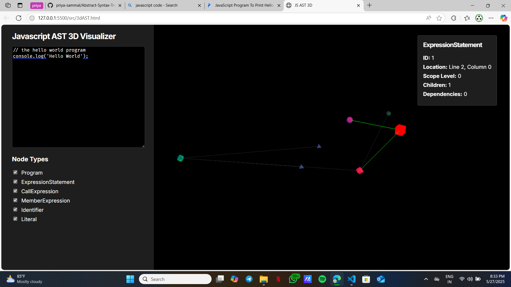

# 3D AST Visualizer

## Overview

The 3D AST Visualizer is a cutting-edge tool for visualizing and exploring Abstract Syntax Trees (ASTs) in three dimensions. Built with Vue 3 and Three.js, this application provides an intuitive and interactive way to understand the structure of code by representing it as a 3D graph.

## Features

- **3D Visualization**: Render ASTs in a 3D space for intuitive exploration.
- **Interactive Controls**: Zoom, pan, and rotate the 3D view to examine the AST from any angle.
- **Syntax Highlighting**: Built-in code editor with syntax highlighting for various programming languages.
- **Real-time Updates**: AST visualization updates in real-time as you modify the code.
- **Node Filtering**: Toggle visibility of different node types to focus on specific aspects of the AST.
- **Node Information**: Hover over nodes to view detailed information about each AST element.
- **Customizable Appearance**: Adjust node colors, shapes, and sizes to suit your preferences.
- **Performance Optimized**: Efficiently handles large ASTs with level-of-detail (LOD) rendering.

## Usage

1. Visit AST3D's website.
2. Enter or paste your code into the editor panel on the left.
3. The 3D visualization of the AST will automatically update in the central panel.
4. Use your mouse to interact with the 3D view:
    - Left-click and drag to rotate
    - Right-click and drag to pan
    - Scroll to zoom in/out
5. Hover over nodes in the 3D view to see detailed information about each AST element.
6. Use the panel on the right to toggle visibility of different node types.
7. Click on a node to focus the camera on it and its connected nodes.
8. Right-click anywhere in the 3D view to reset the camera to its initial position.

[//]: # (## Support)

[//]: # ()
[//]: # (If you encounter any issues or have questions about using the 3D AST Visualizer, please contact our support team at support@3dastvisualizer.com.)

[//]: # ()
[//]: # (## Pricing)

[//]: # ()
[//]: # (For information about our pricing plans and enterprise solutions, please visit our [pricing page]&#40;https://www.3dastvisualizer.com/pricing&#41;.)

[//]: # ()
[//]: # (## Legal)

[//]: # ()
[//]: # (The 3D AST Visualizer is proprietary software. Unauthorized copying, modification, distribution, or use of this software is strictly prohibited.)

[//]: # ()
[//]: # (## Privacy)

[//]: # ()
[//]: # (We take your privacy seriously. For information about how we collect, use, and protect your data, please read our [Privacy Policy]&#40;https://www.3dastvisualizer.com/privacy&#41;.)

[//]: # ()
[//]: # (## Terms of Service)

[//]: # ()
[//]: # (By using the 3D AST Visualizer, you agree to our [Terms of Service]&#40;https://www.3dastvisualizer.com/terms&#41;.)

## Acknowledgments

The 3D AST Visualizer makes use of the following open-source libraries:

- [Vue.js](https://vuejs.org/)
- [Three.js](https://threejs.org/)
- [Acorn](https://github.com/acornjs/acorn)
- [CodeMirror](https://codemirror.net/)

We are grateful to the developers of these libraries for their contributions to the open-source community.